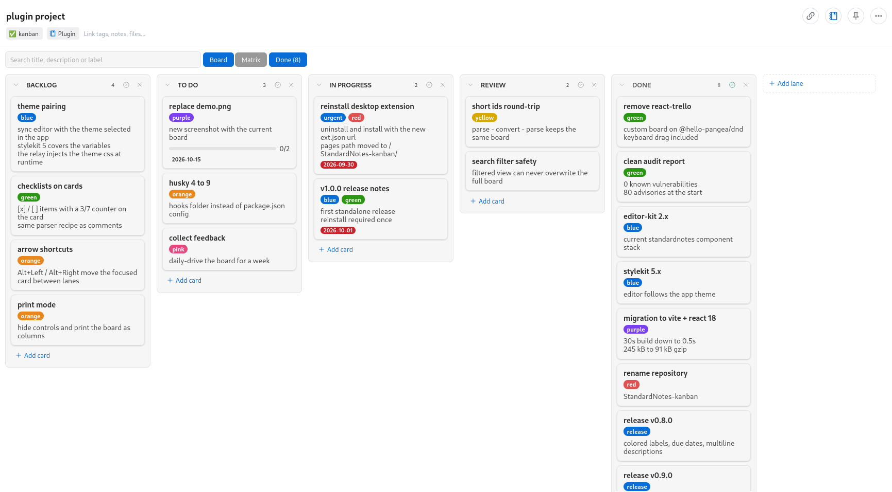

# StandardNotes Kanban

[](https://github.com/Esl1h/StandardNotes-kanban/actions/workflows/ci.yml)
[](https://github.com/Esl1h/StandardNotes-kanban/releases/latest)
[](LICENSE)

A Kanban board editor for [Standard Notes](https://standardnotes.org), a
free, open-source, end-to-end encrypted notes app. Your board is stored as
plain Markdown inside the note, so it stays readable, exportable and
portable.



## Features

1. Manage lanes and cards with titles, descriptions, labels, due dates
   and comments
2. Drag and drop cards between lanes (and reorder them inside a lane),
   with keyboard drag support
3. Reorder, rename and collapse lanes; card counts in lane headers
4. Edit card descriptions, labels, due dates and comments in a card modal
5. Search across titles, descriptions and labels
6. Keyboard shortcuts: `N` adds a card, `Ctrl/Cmd+F` focuses search
7. Your board lives in the note as Markdown; read or tweak it with any
   other editor without breaking the board
8. Works with the Standard Notes web and desktop apps; follows the theme
   selected in the app

## Installation

1. Run the Standard Notes web or desktop app.
2. Click the **Preferences** (gear) icon.
3. Select **Plugins** in the Preferences menu.
4. Scroll to the bottom and paste this URL into the
   **Install Custom Plugin** box:

   ```
   https://esli.cafe/StandardNotes-kanban/ext.json
   ```

5. Confirm the installation.
6. Create a new note, open the **Editor** menu and pick **Kanban**.
7. Add a lane, add some cards, and have fun!

## Note format

The board is saved in the note body as Markdown. One `#` heading per lane,
one `*` bullet per card, indented `*` bullets for card fields:

```
# To Do
* Write the report [id:a3f9k2]
  * Description: Q4 numbers, then review with the team
    > bring the spreadsheet
  * Due: 2026-09-30
  * Label: work, blue
  * Comments:
    * First draft looks good
* Call the bank
```

- `Description` spans multiple lines: continue it with `    > ` lines
- `Label` takes a comma separated list; palette names (`red`, `orange`,
  `yellow`, `green`, `blue`, `purple`, `pink`) render as colored chips,
  any other text renders as a neutral chip
- `Due` takes a `YYYY-MM-DD` date; the card shows an overdue/today badge
- The `[id:xxxxxx]` markers are managed by the editor and keep drag and
  modal references stable between loads; they are recreated
  automatically when missing

Notes saved by the very first release of this editor (raw JSON) are
detected and converted to Markdown automatically the first time they are
edited. Lines the parser cannot understand are kept as-is in the note and
reported in a banner at the top of the board.

## Privacy

Everything is stored inside your Standard Notes note, so it is encrypted
with the rest of your data. The editor itself does not send anything
anywhere.

## Development and running locally

**Prerequisites:**

1. (Optional) Fork this repo on GitHub.
2. [Clone](https://docs.github.com/en/repositories/creating-and-managing-repositories/cloning-a-repository)
   this repo or your fork.
3. Run `cd StandardNotes-kanban` and then `npm install` to install all
   dependencies.

### Testing in the browser (standalone)

1. Run:

```
npm start
```

2. Your browser may open automatically. If not, open
   `http://localhost:3001/`. The standalone editor runs without a Standard
   Notes context, so saving is disabled but the UI is fully usable.
3. When you're done, press `Ctrl/Cmd + C` in the console to stop the app.

### Testing inside your local Standard Notes app

1. Run `npm run build` to build the app, then:

```
npm run server
```

2. In Standard Notes, follow the Installation steps above but paste:

```
http://localhost:3000/ext.dev.json
```

The dev extension uses a separate identifier (`Kanban (Dev)`) so it does
not clash with the hosted one.

3. When you're done, press `Ctrl + C` to shut down the server.

If you run into issues, please refer to the
[Standard Notes instructions for local plugin setup](https://standardnotes.com/help/plugins/local-setup).

### Deployment

The extension is hosted on GitHub Pages from the `gh-pages` branch, served
at `https://esli.cafe/StandardNotes-kanban/`. Releases are automated by
the `Release` workflow:

1. Bump the version in `package.json`, `public/ext.json` and
   `public/ext.dev.json` (the `download_url` points at the release
   asset).
2. Commit, then push a tag:

```
git tag v1.1.0 && git push origin v1.1.0
```

The workflow builds, runs the checks, attaches `extension.zip` to the
GitHub release (that zip is what the desktop app installs) and
publishes the hosted build to Pages.

## Credits and license

- Board concept and early versions by
  [corvec](https://github.com/corvec) (sn-kanban-editor)
- Built on [Standard Notes](https://standardnotes.org) and
  [@standardnotes/editor-kit](https://github.com/standardnotes/editor-kit)
- Licensed under [AGPL-3.0](LICENSE) or later
